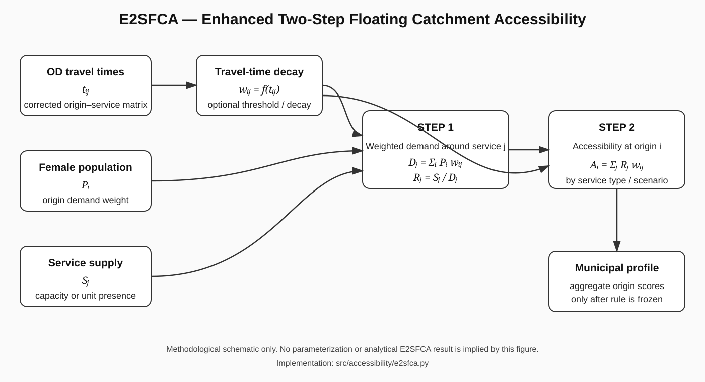
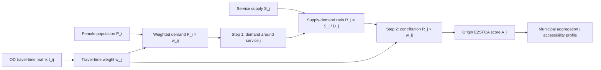
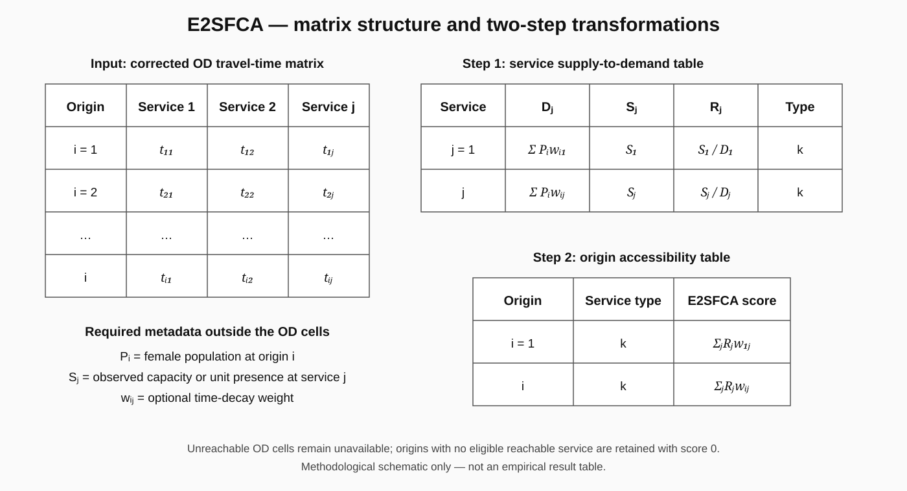

# 04 — Accessibility and E2SFCA

## Role in the pipeline

The accessibility layer transforms origin–service travel times into measures of practical service access. The E2SFCA implementation preserves competition between population demand and service supply while accounting for travel-time impedance.

The executable implementation is available in the consolidated branch at [`src/accessibility/e2sfca.py`](../../src/accessibility/e2sfca.py). It is the same model logic recovered from the earlier accessibility branch; restoring the file is a reproducibility/organization action, not a methodological change.

**Important:** the final MCDM access criteria are direct municipal summaries of the corrected OD matrix. E2SFCA is a complementary accessibility model and must not be described as the source of those four already-frozen criteria.

## Static model diagram

The figure is a methodological schematic only. It does not imply that any threshold, decay function, supply mode or empirical E2SFCA result has already been frozen.

## Two-step model flow

## Inputs

For each origin `i`, service `j`, service type `k` and scenario `s`, the implementation uses:

- `t_ij`: travel time from origin to service;
- `P_i`: female population associated with origin `i`;
- `S_j`: service supply/capacity for service `j` when defensible capacity exists;
- service type, so functionally different services are not treated as substitutes;
- optional catchment threshold;
- optional travel-time decay function.

Two supply modes are implemented:

- `observed_capacity`: use an observed, defensible capacity value;
- `unit_presence`: use one unit per service when capacity data are not defensibly comparable.

## Matrix structure

The OD input can be understood as a temporal matrix:

| Origin / service | Service 1 | Service 2 | ... | Service j |
|---|---:|---:|---:|---:|
| Origin 1 | `t_11` | `t_12` | ... | `t_1j` |
| Origin 2 | `t_21` | `t_22` | ... | `t_2j` |
| ... | ... | ... | ... | ... |
| Origin i | `t_i1` | `t_i2` | ... | `t_ij` |

Each valid temporal cell can receive a decay weight `w_ij`. Cells without an authorized route remain unavailable rather than being assigned a synthetic travel time.

## Travel-time decay

The implementation supports no decay (`w=1`) or explicit decay functions. Included options are exponential and Gaussian decay.

A generic travel-time weight is represented as:

`w_ij = f(t_ij)`

where `f(.)` is non-increasing with travel time under the selected specification.

## Step 1 — service supply-to-demand ratio

For each service `j` within service type `k` and scenario `s`, weighted demand is:

`D_j = Σ_i P_i * w_ij`

The service ratio is then:

`R_j = S_j / D_j`

when weighted demand is positive.

A compact Step-1 output table has the conceptual form:

| Scenario | Service type | Service | Weighted demand `D_j` | Supply `S_j` | Ratio `R_j` |
|---|---|---|---:|---:|---:|
| s | k | j | Σ `P_i w_ij` | observed or unit supply | `S_j / D_j` |

## Step 2 — origin accessibility score

For each origin `i`, the E2SFCA score within service type and scenario is:

`A_i = Σ_j R_j * w_ij`

A compact Step-2 output table has the conceptual form:

| Scenario | Service type | Origin | E2SFCA score |
|---|---|---|---:|
| s | k | i | Σ `R_j w_ij` |

## Zero-access preservation

Origins with no eligible reachable service are retained explicitly with `e2sfca_score = 0`; they are not dropped. This prevents upward bias in municipal summaries, especially for rural and riverine origins.

## Thresholds and scenarios

The implementation permits a maximum catchment time when substantively justified. Scores are computed separately by scenario and service type. Seasonal comparison utilities exist in code, but flood/dry labels must not be asserted unless supported by evidence in the reference model.

## Relationship to municipal MCDM indicators

E2SFCA and the municipal access indicators answer related but distinct questions. The current core MCDM accessibility criteria are:

1. reachable-service fraction;
2. fraction of services within 120 minutes;
3. nearest reachable-service time;
4. median reachable-service time.

These four indicators are calculated from the corrected OD surface and are not transformations of an E2SFCA score.

E2SFCA adds a population-and-supply competition perspective and can be analyzed as a complementary accessibility layer or sensitivity/interpretive analysis after its parameterization is frozen.

## Current execution status

The corrected E2SFCA execution is now **authoritative as a complementary accessibility analysis**. The reference specification uses unit presence, separate service types, a 120-minute catchment, no additional decay parameter, and female-population-weighted municipal aggregation among routing-ready origins. Coverage-limited origins are not assigned synthetic zeros.

Four alternative configurations are published as sensitivity analyses. The complete empirical bundle is available in [`results/e2sfca/`](../../results/e2sfca/), and the formal status is maintained in [`08_reproducibility_status.md`](08_reproducibility_status.md).

## Output documentation rule

When an E2SFCA execution is declared authoritative, its publication bundle must contain:

- exact input OD/network version;
- supply specification and capacity/unit-presence rule;
- threshold and decay parameters;
- service-ratio table;
- origin/sector score table;
- municipal aggregation table when used;
- statewide maps by service type/scenario;
- sensitivity results for threshold/decay/supply mode when applicable.

Every final map must include **title, legend, cartographic scale, north/orientation, latitude/longitude coordinates, source/year, map projection and geographic CRS**.

## Code reference

Current executable implementation:

[`src/accessibility/e2sfca.py`](../../src/accessibility/e2sfca.py)

Core functions:

- `e2sfca(...)`
- `exponential_decay(...)`
- `gaussian_decay(...)`
- `compare_seasons(...)`

No additional E2SFCA output is declared authoritative merely by restoring the implementation; the exact input and parameterization must be recorded alongside any published result.
