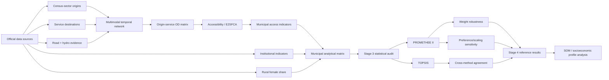

# Reproducible methodology

This directory is the canonical, human-readable pathway from raw data to the current analytical results. It complements the executable scripts and GitHub Actions workflows; it does not replace them.

## Analytical pipeline

**Official data sources** → **census-sector origins and service destinations** → **multimodal temporal network** → **origin–service OD matrix** → **accessibility / E2SFCA layer** → **municipal indicators** → **statistical audit** → **PROMETHEE II + TOPSIS** → **robustness and sensitivity** → **SOM/profile analysis**.

The SOM stage is intentionally not documented as closed yet. Its page will be completed only after its input matrix, training specification and validation are frozen.

## Navigation

1. [Data sources and analytical universe](01_data_sources.md)
2. [Multimodal temporal network](02_multimodal_network.md)
3. [Origin–destination matrix](03_od_matrix.md)
4. [Accessibility and E2SFCA](04_accessibility_e2sfca.md)
5. [Municipal indicator construction](05_municipal_indicators.md)
6. [Statistical audit and criterion selection](06_statistical_audit.md)
7. [MCDM, robustness and final Stage-4 results](07_mcdm_robustness_results.md)

## Authoritative Stage-4 public results

- [`results/stage4/README.md`](../../results/stage4/README.md)
- [`results/stage4/tables/promethee_ii_full_ranking.csv`](../../results/stage4/tables/promethee_ii_full_ranking.csv)
- [`results/stage4/tables/topsis_full_ranking.csv`](../../results/stage4/tables/topsis_full_ranking.csv)
- [`results/stage4/figures/promethee_ii_rank_map.png`](../../results/stage4/figures/promethee_ii_rank_map.png)
- [`results/stage4/figures/topsis_rank_map.png`](../../results/stage4/figures/topsis_rank_map.png)

## Reproducibility policy

The documentation distinguishes three classes of material:

- **authoritative analytical outputs**: frozen/corrected workflow results used by the study;
- **diagnostic or sensitivity outputs**: used to test robustness but not substituted silently for the reference model;
- **scope limitations**: explicitly reported rather than filled with synthetic values.

No undocumented distance-to-time conversion, invented vessel speed, synthetic hydro edge or synthetic MCDM penalty is authorized in the reference analysis.

## Existing detailed audit documents

The following documents remain part of the reproducibility record and are linked from the pages in this directory:

- [`docs/data_inventory.md`](../data_inventory.md)
- [`docs/ibge_census2022_sector_audit.md`](../ibge_census2022_sector_audit.md)
- [`docs/reopened_multimodal_network_audit.md`](../reopened_multimodal_network_audit.md)
- [`docs/stage3_indicator_consolidation.md`](../stage3_indicator_consolidation.md)
- [`docs/stage3_sociodemographic_selection.md`](../stage3_sociodemographic_selection.md)
- [`docs/stage4_mcdm_specification.md`](../stage4_mcdm_specification.md)

## Visual documentation standard

Maps published as final documentation should contain at least: **title, legend, scale, north/orientation indicator, and source/year**. Where a map encodes model results, the method and interpretation direction must also be stated. PNG is used for convenient viewing and SVG/vector output is retained when available for manuscript production.
