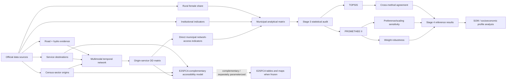

# Reproducible methodology

This directory is the canonical, human-readable pathway from raw data to the current analytical results. It complements the executable scripts and GitHub Actions workflows; it does not replace them.

## Analytical pipeline

**Official data sources** → **census-sector origins and service destinations** → **multimodal temporal network** → **origin–service OD matrix**. From the corrected OD, the final MCDM uses **direct municipal network-access summaries**. The E2SFCA implementation is a **parallel complementary accessibility model** that adds demand/supply competition and must be separately parameterized before its empirical outputs are declared authoritative.

The SOM stage is intentionally not documented as closed yet. Its page will be completed only after its input matrix, training specification and validation are frozen.

## Navigation

1. [Data sources and analytical universe](01_data_sources.md)
2. [Multimodal temporal network](02_multimodal_network.md)
3. [Origin–destination matrix](03_od_matrix.md)
4. [Accessibility and E2SFCA](04_accessibility_e2sfca.md)
5. [Municipal indicator construction](05_municipal_indicators.md)
6. [Statistical audit and criterion selection](06_statistical_audit.md)
7. [MCDM, robustness and final Stage-4 results](07_mcdm_robustness_results.md)
8. [Reproducibility and publication status](08_reproducibility_status.md)

## Permanent visual/result bundles

### Stage 2 — multimodal network

- [`results/stage2_network/README.md`](../../results/stage2_network/README.md)
- statewide corrected multimodal network map;
- detailed Colares correction map;
- detailed Belém–Santa Cruz do Arari correction map;
- network-component, transfer-terminal and cartographic-validation tables.

### Stage 2 — corrected OD matrix

- [`results/stage2_od/README.md`](../../results/stage2_od/README.md)
- reachability summaries by origin and service;
- travel-time quantiles and diagnostic plots;
- illustrative OD matrix;
- full 2,851,425-pair matrix retained as the authoritative workflow artifact rather than duplicated in Git.

### Stage 3 — municipal analytical matrix and audit

- [`results/stage3/README.md`](../../results/stage3/README.md)
- complete municipal matrix;
- missingness/completeness diagnostics;
- Pearson/Spearman correlation matrices;
- VIF diagnostics;
- municipal maps for the nine final MCDM criteria.

### Stage 4 — MCDM

- [`results/stage4/README.md`](../../results/stage4/README.md)
- [`results/stage4/tables/promethee_ii_full_ranking.csv`](../../results/stage4/tables/promethee_ii_full_ranking.csv)
- [`results/stage4/tables/topsis_full_ranking.csv`](../../results/stage4/tables/topsis_full_ranking.csv)
- [`results/stage4/figures/promethee_ii_rank_map.png`](../../results/stage4/figures/promethee_ii_rank_map.png)
- [`results/stage4/figures/topsis_rank_map.png`](../../results/stage4/figures/topsis_rank_map.png)

## E2SFCA status

The executable model is available at [`src/accessibility/e2sfca.py`](../../src/accessibility/e2sfca.py), and its mathematical specification is documented in [`04_accessibility_e2sfca.md`](04_accessibility_e2sfca.md).

At present, code availability must **not** be confused with a frozen empirical E2SFCA result. The final corrected pipeline has not yet declared an authoritative combination of supply mode, catchment threshold, decay function/parameter and municipal aggregation. The exact status and required closure conditions are recorded in [`08_reproducibility_status.md`](08_reproducibility_status.md).

## Reproducibility policy

The documentation distinguishes three classes of material:

- **authoritative analytical outputs**: frozen/corrected workflow results used by the study;
- **diagnostic or sensitivity outputs**: used to test robustness but not substituted silently for the reference model;
- **scope limitations**: explicitly reported rather than filled with synthetic values.

No undocumented distance-to-time conversion, invented vessel speed, synthetic hydro edge or synthetic MCDM penalty is authorized in the reference analysis.

## Existing detailed audit documents

The following documents remain part of the reproducibility record and are linked from the pages in this directory:

- [`docs/data_inventory.md`](../data_inventory.md)
- [`docs/ibge_census2022_sector_audit.md`](../ibge_census2022_sector_audit.md)
- [`docs/reopened_multimodal_network_audit.md`](../reopened_multimodal_network_audit.md)
- [`docs/stage3_indicator_consolidation.md`](../stage3_indicator_consolidation.md)
- [`docs/stage3_sociodemographic_selection.md`](../stage3_sociodemographic_selection.md)
- [`docs/stage4_mcdm_specification.md`](../stage4_mcdm_specification.md)

## Visual documentation standard

Every map published as final documentation must contain:

1. **Title** — what is mapped and, when applicable, the analytical method/scenario.
2. **Legend** — meaning of colors, symbols, hatching, line styles and ranking direction.
3. **Cartographic scale** — a metric scale bar, generated in an appropriate projected CRS.
4. **Orientation** — north arrow or equivalent cartographic north indicator.
5. **Geographic coordinates** — latitude/longitude graticule and coordinate labels, expressed in SIRGAS 2000 geographic coordinates when applicable.
6. **Source and year** — source of the underlying geography/data and reference year/date of the analytical output.
7. **Coordinate reference information** — projected CRS used for cartographic rendering and geographic CRS used for latitude/longitude labels.

For the current statewide Pará maps, the standard is:

- cartographic rendering and scale: **SIRGAS 2000 / Brazil Polyconic (EPSG:5880)**;
- geographic coordinate labels/graticule: **SIRGAS 2000 geographic (EPSG:4674)**;
- municipal boundary reference: **IBGE 2023**.

Where a map encodes model results, the method, interpretation direction and any coverage limitation must also be stated. PNG is used for convenient viewing and SVG/vector output is retained when available for manuscript production.
