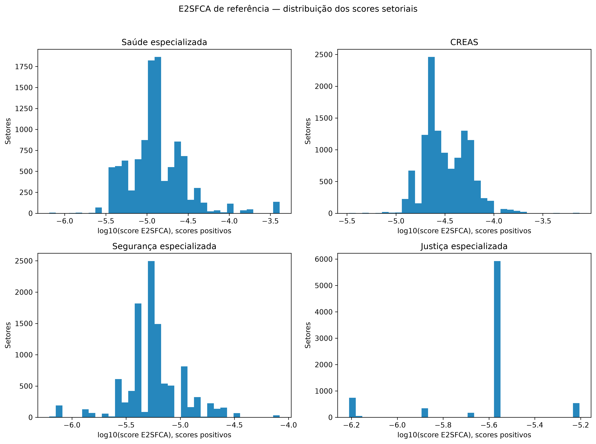
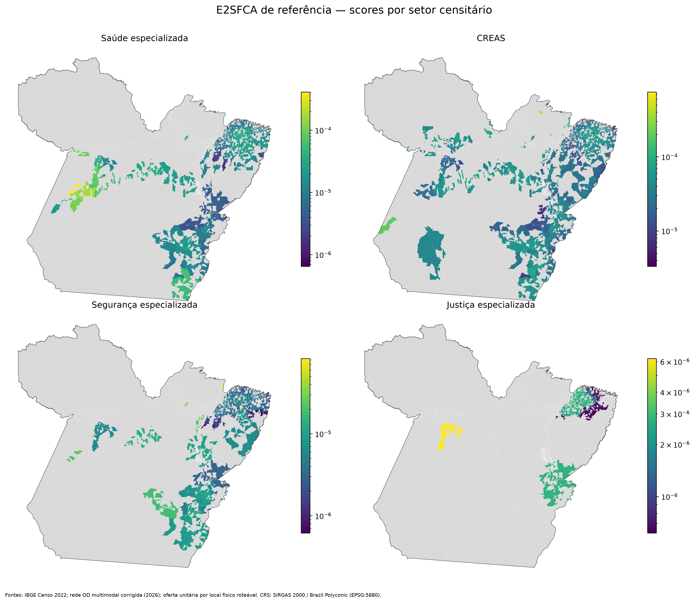
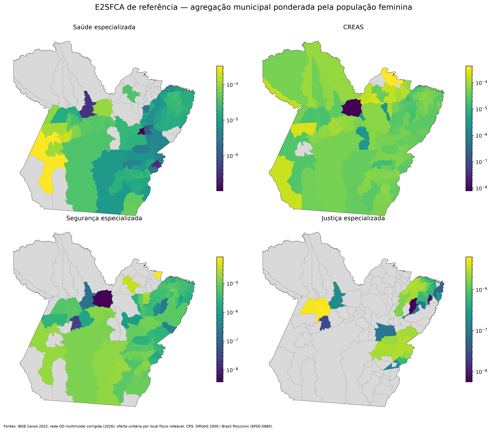
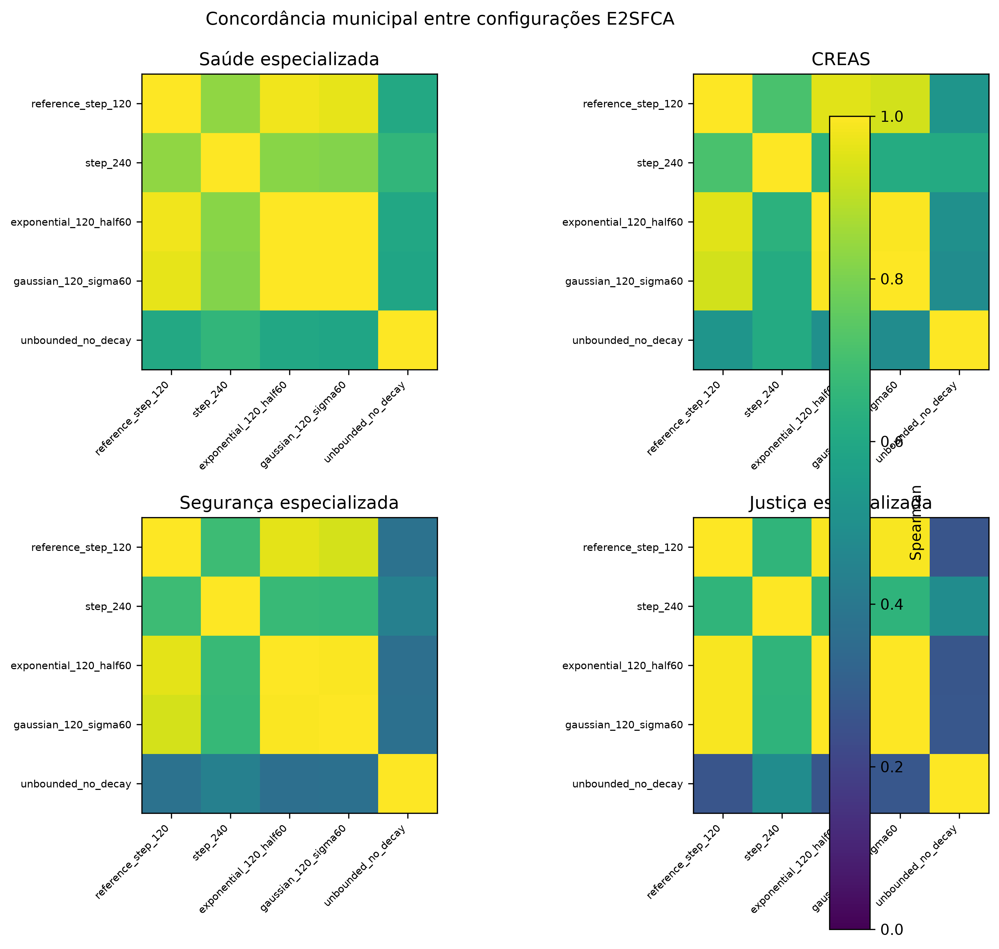

# Item 4 — pacote visual e empírico do E2SFCA

A configuração de referência usa oferta unitária, cálculo separado por tipo de serviço, limite de 120 minutos e nenhuma função adicional de decaimento. Ela minimiza novas suposições e mantém o limite já registrado no estudo. Quatro configurações adicionais são publicadas como sensibilidade.

Afuá e outros setores sem origem primária pronta permanecem como cobertura não avaliada; não recebem score zero sintético.

## Figuras

## Tabelas

- [Scores setoriais de referência](tables/reference_sector_scores.csv.gz)
- [Scores municipais de referência](tables/reference_municipal_scores.csv)
- [Todas as configurações](tables/configuration_municipal_scores.csv)
- [Concordância](tables/configuration_agreement.csv)
- [Razões oferta-demanda](tables/reference_service_ratios.csv)
