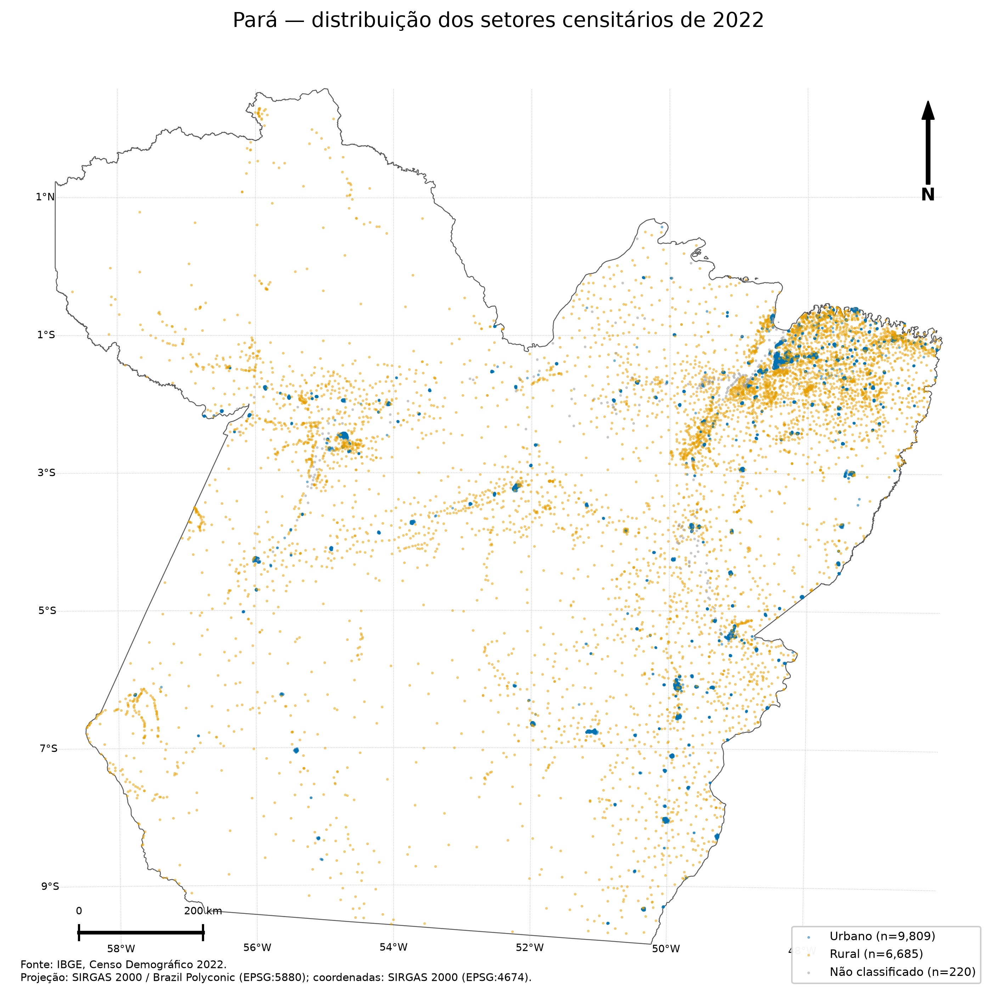
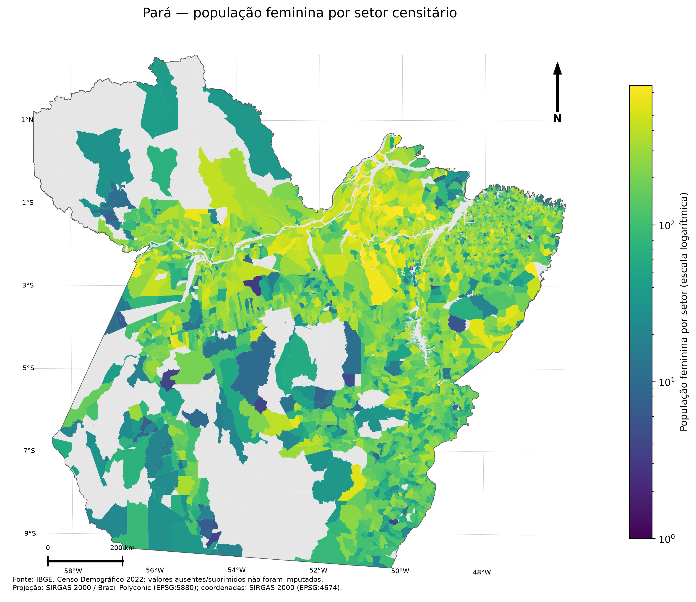
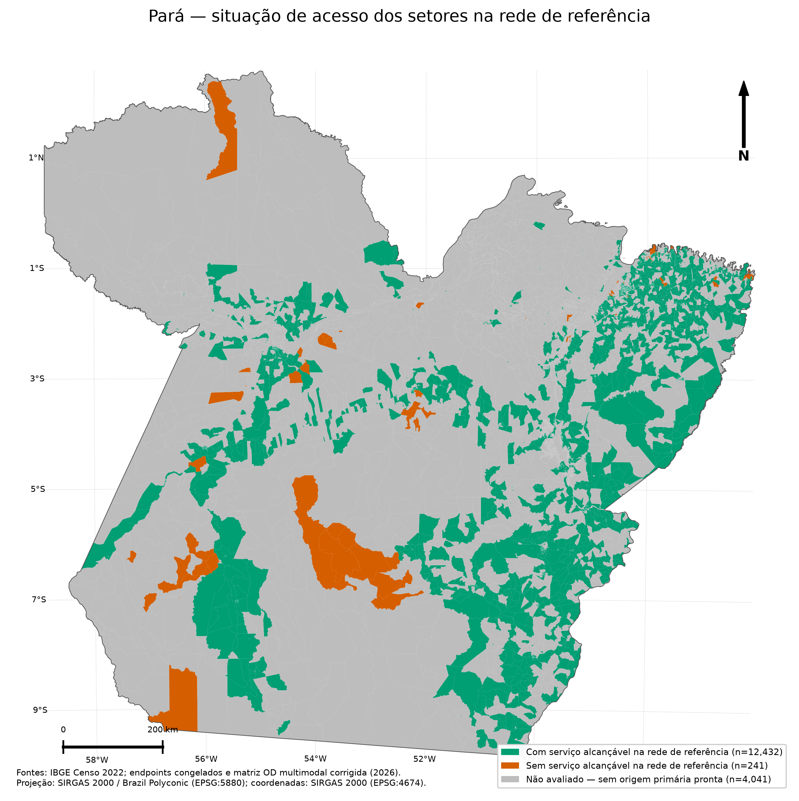

# Item 3 — origens por setor censitário

O pacote representa os 16.714 setores censitários do Pará e preserva separadamente três situações: setor com ao menos um serviço alcançável, setor roteável sem serviço alcançável e setor não avaliado por ausência de origem primária pronta. A terceira classe não é interpretada como inacessibilidade.

## Figuras

## Tabelas

- [Resumo da distribuição setorial](tables/sector_distribution_summary.csv)
- [Resumo da situação de acesso](tables/sector_access_status_summary.csv)
- [Auditoria das origens](tables/sector_origin_audit.csv)
