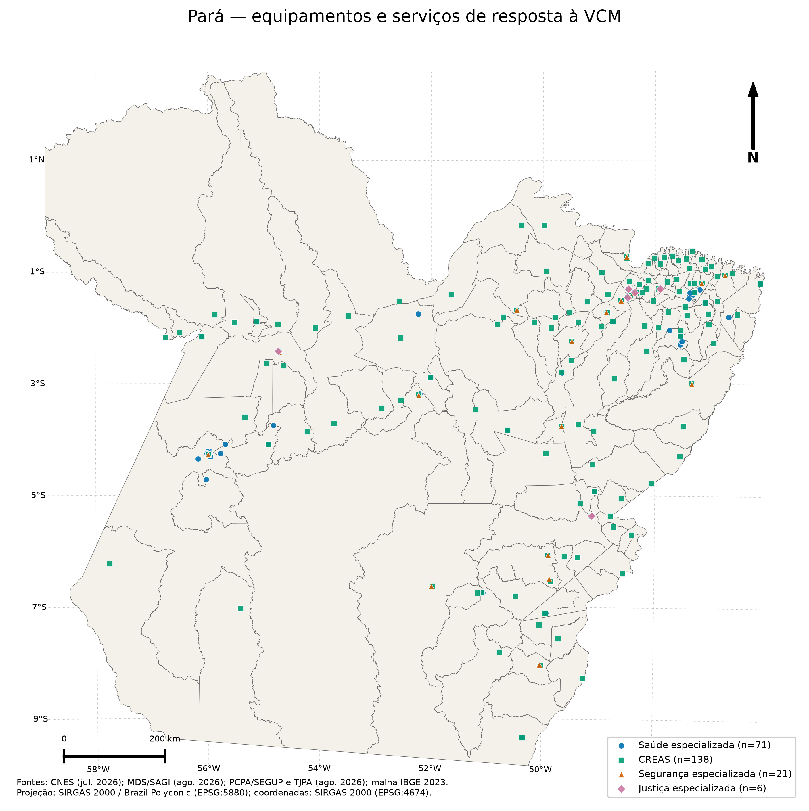

# Item 1 — equipamentos e serviços

Este pacote publica os 236 locais físicos validados usados na camada institucional do estudo. Registros funcionais que compartilham exatamente o mesmo local físico e tipo de serviço são representados por um único ponto; a tabela de auditoria preserva essa consolidação.

## Mapas

- [Saúde especializada](figures/service_sites__health.png)
- [CREAS](figures/service_sites__creas.png)
- [Segurança especializada](figures/service_sites__specialized_security.png)
- [Justiça especializada](figures/service_sites__specialized_justice.png)

Versões SVG editáveis acompanham todos os mapas.

## Tabelas

- [Inventário cartográfico dos locais físicos](tables/validated_physical_service_sites.csv)
- [Resumo por tipo](tables/service_site_summary.csv)

## Limite interpretativo

Os pontos representam oportunidades físicas validadas, não capacidade, qualidade, produtividade ou utilização efetiva dos serviços.
