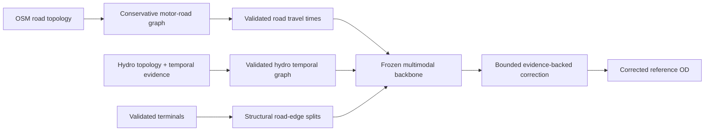
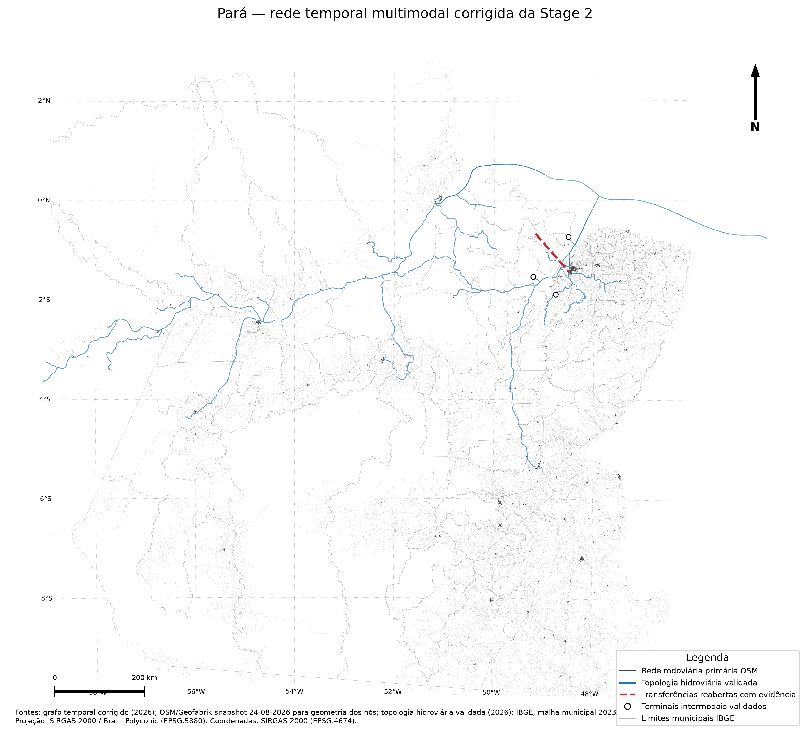
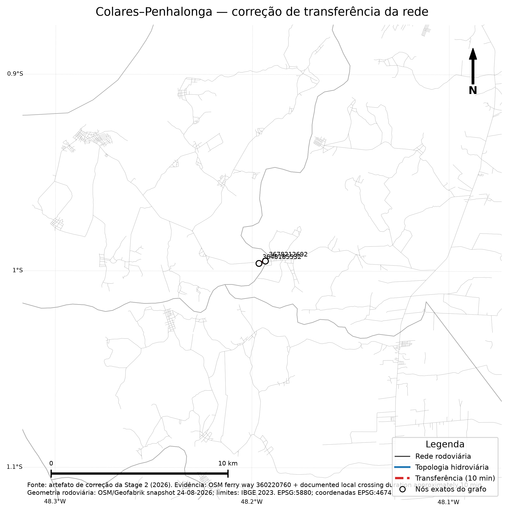
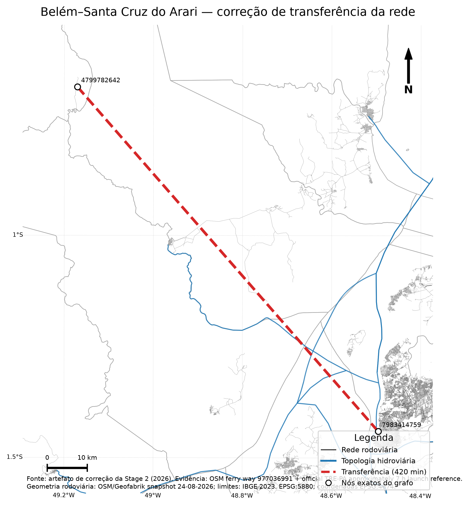

# Stage 2 — corrected multimodal temporal network

This directory documents the **authoritative corrected Stage-2 network** used to rebuild the final OD matrix. The publication step does not recompute routing or travel times; it only attaches cartographic coordinates to the already-frozen node identities for visualization.

## Authoritative provenance

- Frozen backbone run: `32920014705`
- Corrected backbone/OD run: `33089335405`
- Corrected backbone artifact: `pa-corrected-multimodal-backbone`
- Hydro topology run: `32868022260`
- Terminal split run: `32907985189`
- Cartographic OSM snapshot: `norte-260824.osm.pbf`
- Final numeric road-node coordinate coverage: **1.000000**

## Network construction flow

## Figures

### Statewide corrected multimodal network

### Colares transfer correction

### Belém–Santa Cruz do Arari transfer correction

All maps include title, legend, cartographic scale, North arrow, geographic latitude/longitude graticule, source/year and CRS information.

## Validated original road–hydro terminals

| Port | Terminal node | Hydro node |
|---|---|---|
| Muaná | `terminal:antaq_pa_front1_27` | `hydro_route_0076_node_005698` |
| Soure | `terminal:antaq_pa_front1_65` | `hydro_route_0102_node_006305` |
| Moju | `terminal:antaq_pa_front1_25` | `hydro_route_0114_node_007239` |

## Bounded transfer corrections

| Correction | Mode | Time (min) | Endpoint nodes |
|---|---|---:|---|
| Colares - Penhalonga | ferry | 10 | `3648185532` ↔ `3678212692` |
| Belém - Santa Cruz do Arari | scheduled_passenger_hydro | 420 | `4799782642` ↔ `7983414759` |

Afuá receives **no synthetic edge**. Its missing surface-access evidence remains a model-scope/coverage limitation and is not represented as real-world isolation.

## Cartographic reconstruction safeguard

The final temporal road edge table contains node IDs and travel-time impedance but no full coordinate table. For publication only, coordinates are reattached from the pinned historical Geofabrik Norte OSM snapshot that was current immediately before the authoritative terrestrial-time workflow. The publisher fails unless every numeric road node in the final corrected graph is present. Synthetic intermodal terminal coordinates are reproduced from the exact source OSM road segment and the locked projection fraction used during the original road-edge split.

This coordinate attachment does **not** change edge membership, direction, impedance, speed, waiting time or OD results.

## Tables

- [`network_component_summary.csv`](tables/network_component_summary.csv)
- [`validated_transfer_terminals.csv`](tables/validated_transfer_terminals.csv)
- [`bounded_transfer_corrections.csv`](tables/bounded_transfer_corrections.csv)
- [`cartographic_node_validation.csv`](tables/cartographic_node_validation.csv)
