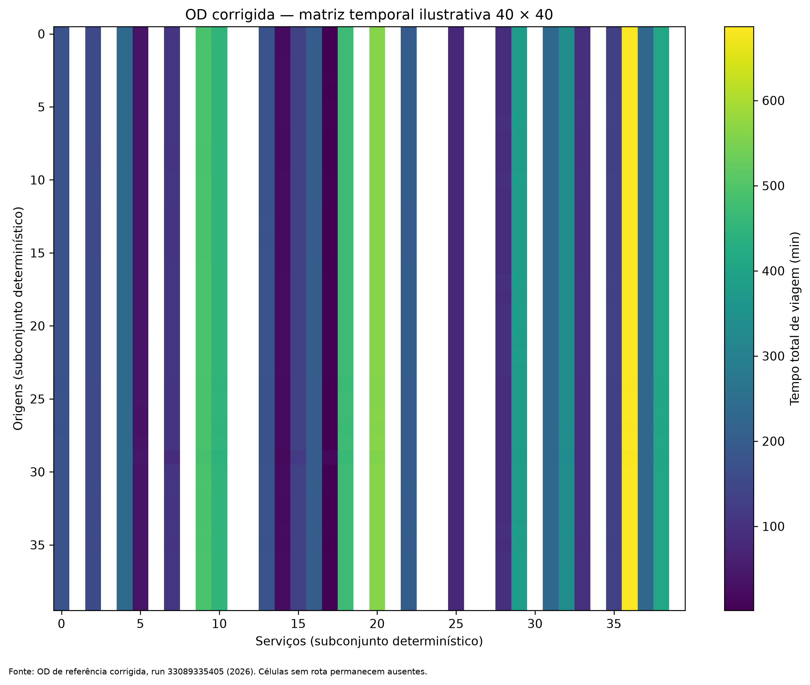
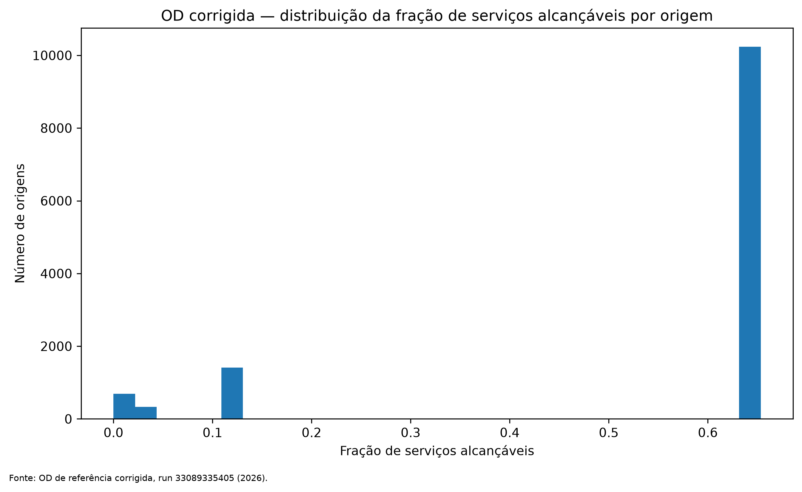
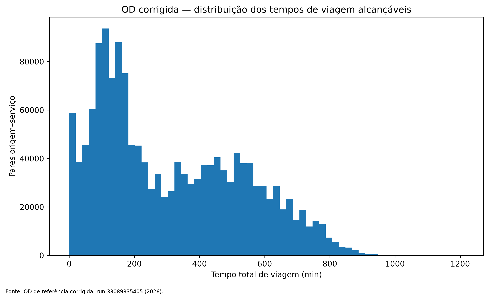

# Stage 2 — corrected origin–destination matrix

This directory documents the authoritative corrected origin–service OD matrix without duplicating the full 2.85-million-row file inside Git history.

## Authoritative provenance

- Corrected OD run: `33089335405`
- Artifact: `pa-corrected-reference-od`
- Origins: 12,673
- Services: 225
- OD pairs: 2,851,425
- Reachable pairs: 1,542,802
- Unreachable pairs: 1,308,623

The full compressed OD matrix remains the authoritative workflow artifact. The files here are permanent audit/documentation derivatives.

## Permanent tables

- [OD audit metadata](tables/od_reference_network_audit.json)
- [Origin reachability summary](tables/origin_reachability_summary.csv.gz)
- [Service reachability summary](tables/service_reachability_summary.csv.gz)
- [Reachable travel-time quantiles](tables/reachable_travel_time_quantiles.csv)
- [Illustrative 40 × 40 OD time matrix](tables/representative_od_time_matrix_40x40.csv)

## Figures

The 40 × 40 matrix is explicitly illustrative and deterministic; it is not a substitute for the full OD artifact. Unreachable cells are not assigned synthetic travel times.
