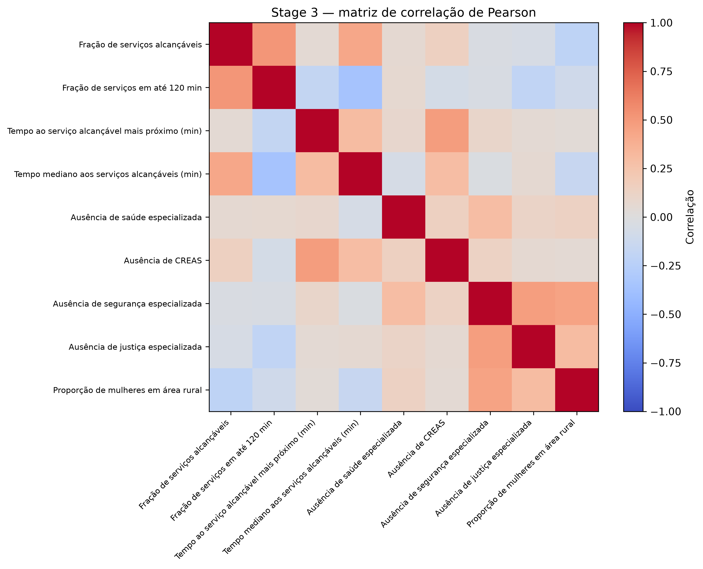
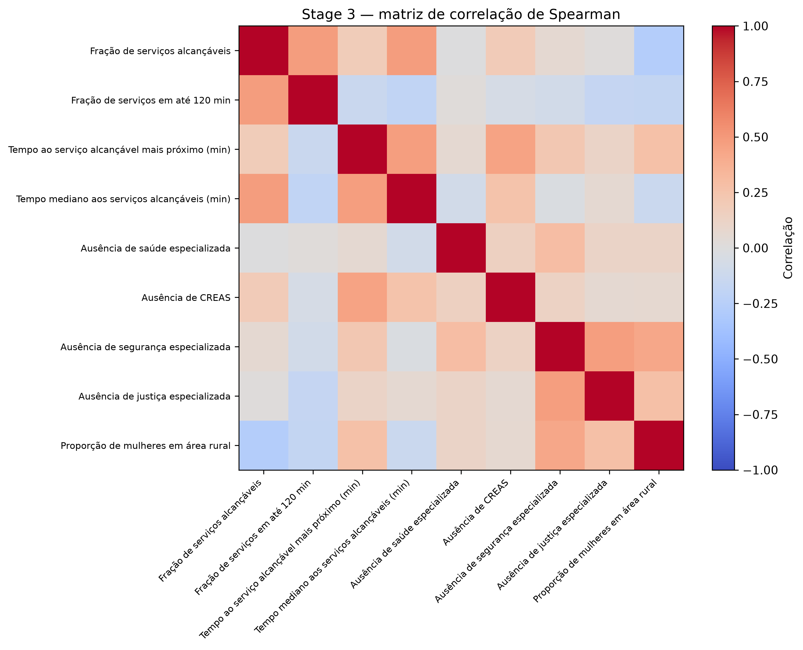
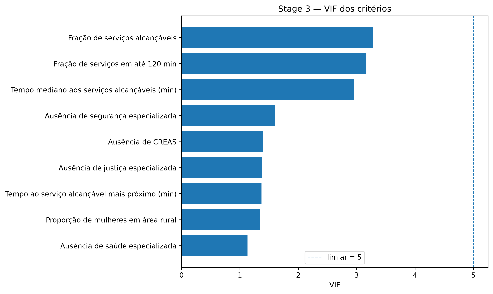
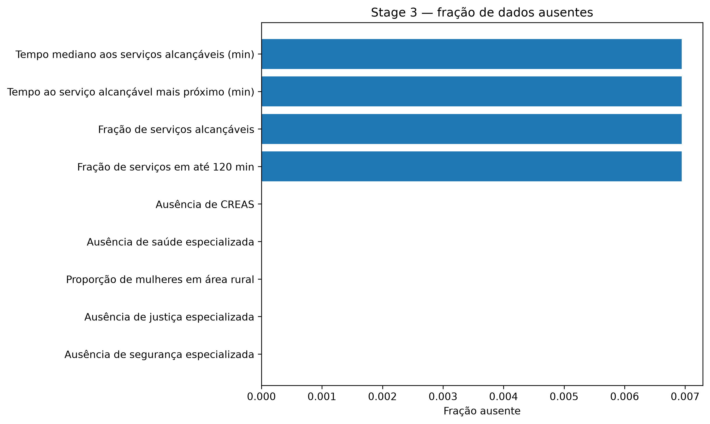

# Stage 3 — municipal analytical matrix and statistical audit

This directory permanently publishes the authoritative corrected Stage-3 outputs used by Stage 4.

## Provenance

- Authoritative run: `33090126353`
- Source artifact: `stage3-corrected-after-network-fix`
- Municipalities: 144

## Tables

- [Municipal analytical matrix](tables/municipal_analytical_matrix.csv)
- [Indicator completeness](tables/indicator_completeness.csv)
- [Indicator distributions](tables/indicator_distribution.csv)
- [Pearson correlation matrix](tables/correlation_pearson.csv)
- [Spearman correlation matrix](tables/correlation_spearman.csv)
- [VIF](tables/vif.csv)
- [Redundancy flags](tables/redundant_indicator_pairs.csv)
- [Special-municipality audit](tables/special_municipality_audit.csv)

## Figures

## Criterion maps

Each of the nine MCDM criteria has a statewide map under [`figures/criterion_maps/`](figures/criterion_maps/). Final maps include title, legend, scale, north arrow, latitude/longitude graticule, source/year and CRS information.

## Audit conclusion

- redundant pairs at |r|/|rho| >= 0.80: **0**
- VIF indicators >= 5: **0**
- maximum VIF: **3.2826404630416786**
- PCA recommended: **False**
