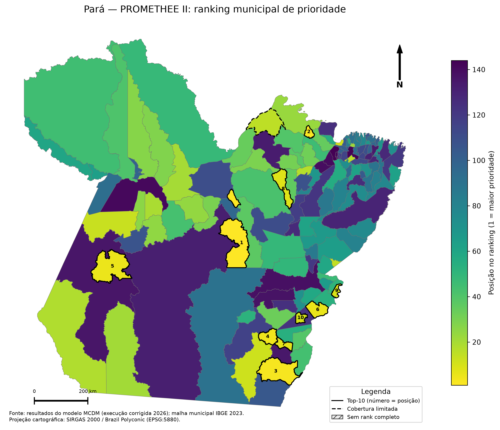
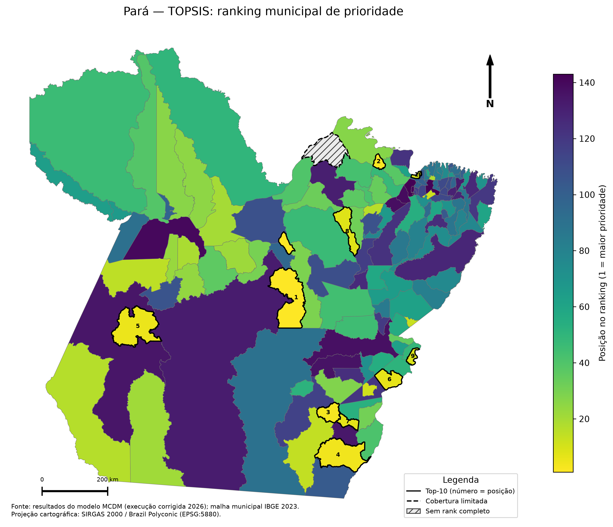

# Stage 4 — MCDM results

This directory contains the **authoritative corrected** municipal prioritization outputs after the multimodal network correction.

## Authoritative provenance

- Corrected OD workflow run: `33089335405`
- Corrected Stage 3/Stage 4 workflow run: `33090126353`
- Source artifact: `stage4-mcdm-corrected-after-network-fix`
- PROMETHEE II is the primary MCDM method.
- TOPSIS is an independent contrast method.
- Afuá is retained as a coverage/scope-limited municipality; no synthetic accessibility value is created.

## Complete tables

- [PROMETHEE II — full 144-municipality table](tables/promethee_ii_full_ranking.csv)
- [TOPSIS — full 144-municipality table](tables/topsis_full_ranking.csv)

The TOPSIS table contains all 144 municipalities, but Afuá has no TOPSIS rank because TOPSIS requires a complete criterion vector. This is intentional and should not be imputed.

## Statewide maps

All maps include title, legend, cartographic scale, north arrow, source/year and the municipal boundary reference.

### PROMETHEE II

Vector version: [SVG](figures/promethee_ii_rank_map.svg)

### TOPSIS

Vector version: [SVG](figures/topsis_rank_map.svg)

## PROMETHEE II reference top 10

| Rank | Municipality | Net flow |
|---:|---|---:|
| 1 | Senador José Porfírio | 0.260471 |
| 2 | Santa Cruz do Arari | 0.258409 |
| 3 | Santa Maria das Barreiras | 0.218665 |
| 4 | Bannach | 0.217833 |
| 5 | Trairão | 0.208489 |
| 6 | Piçarra | 0.192140 |
| 7 | Pau D'Arco | 0.176341 |
| 8 | Bagre | 0.167114 |
| 9 | Palestina do Pará | 0.148791 |
| 10 | Sapucaia | 0.140102 |

## TOPSIS contrast top 10

| Rank | Municipality | TOPSIS score |
|---:|---|---:|
| 1 | Senador José Porfírio | 0.726918 |
| 2 | Santa Cruz do Arari | 0.701053 |
| 3 | Bannach | 0.680535 |
| 4 | Santa Maria das Barreiras | 0.677084 |
| 5 | Trairão | 0.669112 |
| 6 | Piçarra | 0.660634 |
| 7 | Pau D'Arco | 0.643299 |
| 8 | Bagre | 0.637157 |
| 9 | Palestina do Pará | 0.624754 |
| 10 | Colares | 0.618808 |

## Interpretation

The maps visualize rank, while the CSV files preserve the method-specific scores and the full municipal ordering. Exact rank should not be interpreted as a deterministic policy truth; the manuscript should report the reference ordering together with weight robustness, PROMETHEE–TOPSIS agreement, and preference/scaling sensitivity.

The corrected PROMETHEE II and TOPSIS rankings have very high agreement on the 143 complete alternatives (Spearman approximately 0.9984).

## Reproducibility

The publication files in this directory are generated by `src/analysis/publish_stage4_results.py` through `.github/workflows/publish-stage4-results.yml`. Municipal geometry is downloaded from the official IBGE 2023 municipal boundary release for Pará.
